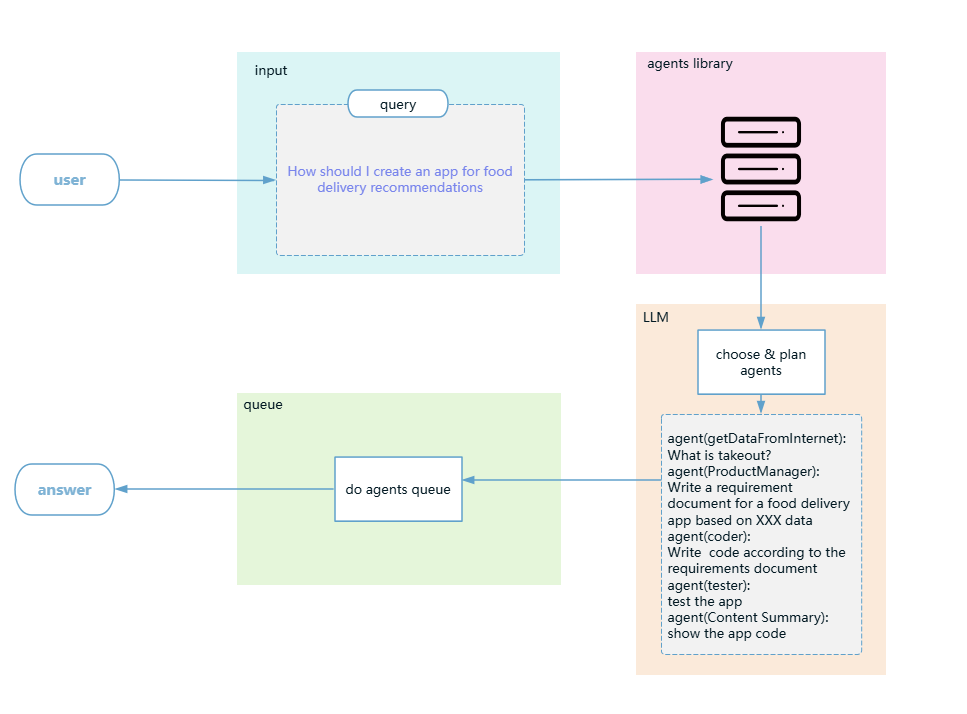

# **AgentFlow**

## **一、项目概述：**

**AgentFlow** 是一个基于智能代理（AI-Agent）技术设计的自动化任务分配与执行系统。该系统能够通过高效的代理协同工作，完成复杂任务的自动分解、执行和反馈。其核心目标是通过智能代理对不同任务的自动化处理和动态知识整合，实现对复杂业务流程的优化和高效执行。

## **二、核心功能模块：**

1. **任务分配与调度：**
   - 用户将任务请求提交到系统，系统将根据任务内容和需求，将任务分解成多个子任务并分派到不同的代理（Agent）。
   - 任务分配模块负责任务的分解、代理的选择和执行顺序的确定。该模块支持多级任务分解，使任务能够在复杂场景下得到高效处理。

2. **智能代理（Agents）执行：**
   - 系统能够从外部网络、数据库和文件库中动态获取与任务相关的知识，并整合到内存中，以供代理使用。这一过程是通过与外部资源库（向量库、文件库、数据库）交互来实现的。
   - 知识整合不仅限于任务执行时的即时补充，还包括持久化存储，以便在未来的任务中重复使用。
   - 系统根据任务类型选择合适的智能代理进行处理。每个代理负责任务的特定部分，代理之间通过反馈机制进行交互与优化。
   - 每个代理可以执行单独的任务，例如数据分析、任务优化、资源整合等，最终将结果整合并返回给系统。

3. **调试与反馈机制：**
   - 在任务执行过程中，系统内置的调试模块能够实时监控任务执行的状态，并根据反馈调整任务执行的流程。反馈机制保证了任务的执行过程能够应对各种变化和异常情况。

4. **用户自定义代理管理：**
   - 用户可以根据需求自定义智能代理，并将其配置到系统中。系统支持通过外部链接定义自定义代理的行为，并在任务分配时选择适合的代理执行任务。
   - 代理管理模块允许用户对代理进行动态添加、配置、启用和停用。


## **三、功能实现细节：**

### **1. 任务分配与调度模块：**

- **任务接收**：系统通过 RESTful API 接收任务请求。任务请求中包含任务描述、优先级、时间要求等信息。任务可以是任何形式的请求，比如数据处理、报告生成、流程优化等。
  
- **任务分解**：
   - 基于任务的内容，系统将任务分解为多个子任务。每个子任务进行串行处理，以提高任务准确度。
   - 任务分解时，系统根据任务复杂度、依赖关系和执行顺序来选择合适的代理，保证任务顺利推进。

- **代理选择与执行顺序**：
   - 系统根据代理的能力、任务的需求以及执行的优先级来决定任务的分派顺序。例如，如果任务需要数据分析、优化和结果整合，系统会依次选择合适的代理进行处理。
   - 代理选择的过程是动态的，系统能够在任务执行过程中实时调整，确保任务高效完成。

### **2. 智能代理（Agent）执行：**

- **外部知识获取**：系统支持通过接口从外部资源库获取实时的知识信息。这些知识信息存储在向量库、文件库和数据库中，并供智能代理在执行过程中使用。
  
- **向量数据库**：
   - 用于存储知识的高维向量，支持快速的相似度查询。代理在执行任务时，如果需要额外的知识支持，能够通过向量数据库快速检索相关信息。
  
- **文件库和数据库**：
   - 系统还支持将整理后的任务信息存储到文件库和传统数据库中，供后续查询和使用。

每个代理在执行任务时都有明确的职责，它们分别承担任务的不同部分，并进行反馈和调整，比如：

- **Agent1（任务分析与初步处理）**：
   - 负责对任务进行初步的分析与处理，评估任务的需求，并确定执行所需的资源。根据任务的输入，生成初步的执行计划。

- **Agent2（任务优化与执行细化）**：
   - 基于 Agent1 的分析结果，Agent2 负责任务的细化优化。可能包括算法选择、数据格式转换、任务优先级重新调整等操作。

- **Agent3（结果整合与输出）**：
   - 负责将所有已完成的子任务结果整合并输出最终结果。最终结果可能包括报告生成、数据输出、或执行指令等。


### **3. 调试与反馈机制：**

- **任务监控**：在任务执行过程中，系统会实时监控任务的状态并记录日志。若发现任务执行异常，系统会自动触发调试机制。
  
- **调试模块**：调试模块能够实时分析任务执行中的问题，并向任务分配模块提供反馈。系统会根据这些反馈对代理执行流程进行动态调整。
  
- **反馈机制**：
   - 反馈不仅是调试信息，还包括任务执行过程中收集到的其他信息。系统根据反馈调整任务执行顺序、重新选择代理，或者调用额外的知识资源，确保任务的成功执行。

### **4. 用户自定义代理管理：**

- **自定义代理**：
   - 用户可以根据具体的需求开发自定义代理，并通过配置文件将其加入到系统中。代理可以通过 REST API 或其他协议进行集成。
  
- **代理配置**：
   - 系统提供图形化界面或配置文件管理功能，用户可以方便地对代理进行配置、启用和停用。代理的定义包括其功能、执行顺序、以及所需的输入和输出。

## **四、项目架构图：**



## **五、总结与未来展望：**

**AgentFlow** 通过高效的任务分解和多级代理协作，能够处理复杂的自动化任务，适用于各类需要自动化处理和动态优化的场景。随着系统的不断完善，未来可以扩展更多的自定义代理、增强反馈机制、以及与更多外部资源的集成。

该项目的核心价值在于其高度的可扩展性和灵活性，用户不仅可以根据自身需求自定义代理，还可以自由配置任务执行流程和优先级，完全适配各种实际业务需求。


## 贡献
欢迎对本项目提出建议或贡献代码！请通过以下方式提交您的贡献：
1. Fork 本仓库
2. 提交您的修改到新分支
3. 提交 Pull Request


## 🌟 Star History

<a href="https://github.com/lgvt369/AgentFlow/stargazers" target="_blank" style="display: block" align="center">
  <picture>
    <source media="(prefers-color-scheme: dark)" srcset="https://api.star-history.com/svg?repos=lgvt369/AgentFlow&type=Date&theme=dark" />
    <source media="(prefers-color-scheme: light)" srcset="https://api.star-history.com/svg?repos=lgvt369/AgentFlow&type=Date" />
    
  </picture>
</a>

## 联系我们
如有任何问题，请通过[Issues](https://github.com/lgvt369/AgentFlow/issues)提交反馈。
```

请根据实际代码与需求进行细化。如果需要具体的代码文件描述，我也可以继续补充！
```
